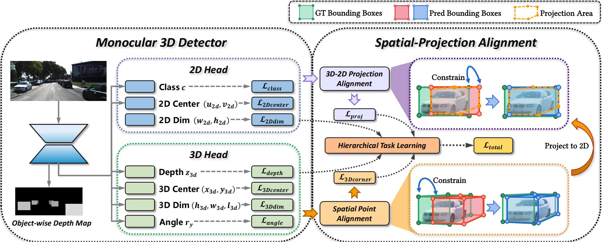
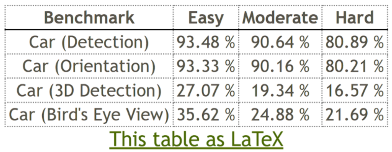
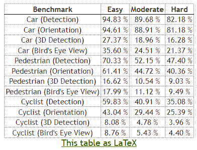

<div align="center">
<h1>SPAN: Spatial-Projection Alignment for Monocular 3D Object Detection</h1>
</div>

<div align="center">
  <a href='https://wyfdut.github.io/SPAN/'></a>
  <a href='https://arxiv.org/abs/2511.06702'></a>
  <a href='https://huggingface.co/yifanwang08/SPAN_Validation/tree/main'></a>
  <a href='https://github.com/WYFDUT/SPAN'></a>
</div>

<br>

<p align="center">
  <b>Yifan Wang<sup>1,4</sup>, Yian Zhao<sup>2</sup>, Fanqi Pu<sup>1</sup>, Xiaochen Yang<sup>3</sup>, Yang Tang<sup>4</sup>, Xi Chen<sup>4</sup>, Wenming Yang<sup>1,†</sup></b><br>
  <br>
  <sup>1</sup>Tsinghua University &nbsp;&nbsp; <sup>2</sup>Peking University &nbsp;&nbsp; <sup>3</sup>University of Glasgow &nbsp;&nbsp; <sup>4</sup>Tencent BAC &nbsp;&nbsp<br>
  <br>
  <sup>†</sup>Corresponding Authors<br>
  <br>
  <i>📧 yf-wang23@mails.tsinghua.edu.cn &nbsp;&nbsp; yang.wenming@sz.tsinghua.edu.cn</i>
  <br>
</p>

---

## 📌 Introduction

<div align="center">
  
</div>

This repository hosts the official implementation of **SPAN (Spatial-Projection Alignment)**, a novel framework for monocular 3D object detection that addresses the geometric consistency constraints overlooked in existing decoupled regression paradigms.

**SPAN** introduces a unified geometric consistency optimization paradigm that comprises two pivotal components:

- **Spatial Point Alignment**: Enforces an explicit global spatial constraint between predicted and ground-truth 3D bounding boxes by aligning their eight corner coordinates in the camera coordinate system, thereby rectifying spatial drift caused by decoupled attribute regression.

- **3D-2D Projection Alignment**: Ensures that the projected 3D box is aligned tightly within its corresponding 2D detection bounding box on the image plane, mitigating projection misalignment overlooked in previous works.

To ensure training stability, we further introduce a **Hierarchical Task Learning (HTL)** strategy that progressively incorporates spatial-projection alignment as 3D attribute predictions refine, preventing early stage error propagation across attributes.

## Key Features

- 🎯 **Spatial Point Alignment**: Constrains 3D bounding box corners to align with ground-truth corners
- 📐 **3D-2D Projection Alignment**: Ensures projected 3D boxes match their 2D detection boxes
- 📈 **Hierarchical Task Learning**: Progressive training strategy for stable optimization
- 🔌 **Plug-and-Play**: Can be easily integrated into any monocular 3D detector
- ⚡ **Zero Inference Cost**: No additional modules or computational overhead at inference time

## Installation

1. **Clone the repository**:
   ```bash
   git clone https://github.com/WYFDUT/SPAN.git
   cd SPAN

   conda create -n span python=3.8
   conda activate span
   ```

2. **Install dependencies**:
   ```bash
   pip install torch==1.9.0+cu111 torchvision==0.10.0+cu111 torchaudio==0.9.0 -f https://download.pytorch.org/whl/torch_stable.html

   pip install -r requirements.txt

   cd lib/models/monodgp/ops/
   bash make.sh
   cd ../../../..
   ```

3. **Install OpenPCDet** (if needed):
   ```bash
   cd OpenPCDet
   python setup.py develop
   cd ..
   ```

## Data Preparation

### Data Format

Download [KITTI](http://www.cvlibs.net/datasets/kitti/eval_object.php?obj_benchmark=3d) datasets and prepare the directory structure as:
```bash
│SPAN/
├──...
│data/kitti/
├──ImageSets/
├──training/
│   ├──image_2
│   ├──label_2
│   ├──calib
├──testing/
│   ├──image_2
│   ├──calib
```

Update the dataset path in `configs/span.yaml`:
```yaml
dataset:
  root_dir: '/path/to/KITTI'
```

## Training

**Basic usage**:
```bash
bash train.sh configs/span.yaml
```

**With custom GPU**:
```bash
CUDA_VISIBLE_DEVICES=0 bash train.sh configs/span.yaml
```

Checkpoints are saved to the path specified in `trainer.save_path`.

## Test

The best checkpoint will be evaluated as default. You can change it at "tester/checkpoint" in `configs/span.yaml`:
  ```bash
  bash test.sh configs/span.yaml
  ```

## Results

The official results in the paper:

<table>
    <tr>
        <td rowspan="2",div align="center">Models</td>
        <td colspan="3",div align="center">Val, AP<sub>3D|R40</sub></td>   
    </tr>
    <tr>
        <td div align="center">Easy</td> 
        <td div align="center">Mod.</td> 
        <td div align="center">Hard</td> 
    </tr>
    <tr>
        <td rowspan="4",div align="center">MonoDGP + (SPAN)</td>
        <td div align="center">30.98%</td> 
        <td div align="center">23.26%</td> 
        <td div align="center">20.17%</td> 
    </tr>  
</table>

This repo results on KITTI Val Split:

<table>
    <tr>
        <td rowspan="2",div align="center">Models</td>
        <td colspan="3",div align="center">Val, AP<sub>3D|R40</sub></td>   
        <td rowspan="2",div align="center">Logs</td>
        <td rowspan="2",div align="center">ckpt</td>
    </tr>
    <tr>
        <td div align="center">Easy</td> 
        <td div align="center">Mod.</td> 
        <td div align="center">Hard</td> 
    </tr>
    <tr>
        <td rowspan="4",div align="center">MonoDGP + (SPAN)</td>
        <td div align="center">31.92%</td> 
        <td div align="center">23.32%</td> 
        <td div align="center">20.00%</td> 
        <td align="center"><a href="docs/logs/train1.log">log</a></td>
        <td align="center"><a href="https://huggingface.co/yifanwang08/SPAN_Validation/blob/main/span_0.pth">ckpt</a></td>
    </tr>  
  <tr>
        <td div align="center">30.94%</td> 
        <td div align="center">23.34%</td> 
        <td div align="center">20.21%</td> 
        <td align="center"><a href="docs/logs/train2.log">log</a></td>
        <td align="center"><a href="#">-</a></td>
    </tr>  
  <tr>
        <td div align="center">31.81%</td> 
        <td div align="center">23.44%</td> 
        <td div align="center">20.29%</td> 
        <td align="center"><a href="docs/logs/train3.log">log</a></td>
        <td align="center"><a href="https://huggingface.co/yifanwang08/SPAN_Validation/blob/main/span_1.pth">ckpt</a></td>
    </tr>  
</table>


The official results in the paper on KITTI Test Split:

<table>
    <tr>
        <td rowspan="2",div align="center">Models</td>
        <td colspan="3",div align="center">Test, AP<sub>3D|R40</sub></td> 
        <td rowspan="2",div align="center">ckpt</td>
    </tr>
    <tr>
        <td div align="center">Easy</td> 
        <td div align="center">Mod.</td> 
        <td div align="center">Hard</td> 
    </tr>
    <tr>
        <td rowspan="4",div align="center">MonoDGP + (SPAN)</td>
        <td div align="center">27.02%</td> 
        <td div align="center">19.30%</td> 
        <td div align="center">16.49%</td> 
        <td align="center"><a href="#">-</a></td>
    </tr>  
</table>

Test results submitted to the official KITTI Benchmark:

Car category: 
<div>
  
</div>

All categories:
<div>
  
</div>

## Citation

If you use this code in your research, please cite:

```bibtex
@misc{wang2025spanspatialprojectionalignmentmonocular,
      title={SPAN: Spatial-Projection Alignment for Monocular 3D Object Detection}, 
      author={Yifan Wang and Yian Zhao and Fanqi Pu and Xiaochen Yang and Yang Tang and Xi Chen and Wenming Yang},
      year={2025},
      eprint={2511.06702},
      archivePrefix={arXiv},
      primaryClass={cs.CV},
      url={https://arxiv.org/abs/2511.06702}, 
}
```

## License

This project is licensed under the Apache License 2.0. See the [LICENSE](LICENSE) file for details.

## Acknowledgments

This repo benefits from the excellent work [MonoDGP](https://github.com/PuFanqi23/MonoDGP), [OpenPCDet](https://github.com/open-mmlab/OpenPCDet), [MGIoU](https://github.com/ldtho/MGIoU) and related monocular 3D detection frameworks.
